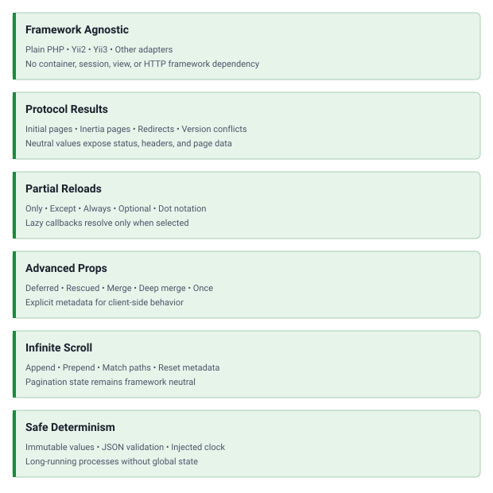

<!-- markdownlint-disable MD041 -->
<p align="center">
    <a href="https://github.com/php-forge/inertia" target="_blank">
      
    </a>
    <h1 align="center">Inertia</h1>
    <br>
</p>
<!-- markdownlint-enable MD041 -->

<p align="center">
    <a href="https://github.com/php-forge/inertia/actions/workflows/build.yml" target="_blank">
        
    </a>
    <a href="https://dashboard.stryker-mutator.io/reports/github.com/php-forge/inertia/main" target="_blank">
        
    </a>
    <a href="https://github.com/php-forge/inertia/actions/workflows/ecs.yml" target="_blank">
        
    </a>
    <a href="https://github.com/php-forge/inertia/actions/workflows/dependency-check.yml" target="_blank">
        
    </a>
</p>

<p align="center">
    <strong>A framework-agnostic PHP core for negotiating and producing current Inertia.js protocol data.</strong>
</p>

## Features

<picture>
    <source media="(min-width: 768px)" srcset="./docs/svgs/features.svg">
    
</picture>

## Installation

```bash
composer require php-forge/inertia:^0.2
```

PHP 8.3 or later and the JSON extension are required.

## Quick start

```php
use PHPForge\Inertia\{PageInput, Protocol, RequestContext};
use PHPForge\Inertia\Prop\Prop;

$request = new RequestContext(
    method: 'GET',
    url: '/users?page=1',
    absoluteUrl: 'https://example.com/users?page=1',
    headers: [
        'X-Inertia' => 'true',
        'X-Inertia-Version' => 'assets-v1',
    ],
);

$input = PageInput::create(
    component: 'Users/Index',
    props: [
        'users' => Prop::merge(fn (): array => loadUsers())->append('data', 'id'),
        'analytics' => Prop::defer(fn (): array => loadAnalytics(), group: 'analytics'),
        'filters' => Prop::optional(fn (): array => availableFilters()),
    ],
    version: 'assets-v1',
)
->withSharedProps(
    [
        'auth' => Prop::once(fn (): array => currentUser())->as('authenticated-user'),
    ],
)
->withErrors(validationErrors())
->withFlash(flashedData());

$result = Protocol::create()->page($request, $input);
```

`Protocol` does not return a framework response. An adapter inspects the result, applies `statusCode()` and `headers()`,
serializes `page()` for an Inertia visit, or embeds the page JSON in the root HTML document for an initial visit.

## Adapter boundary

The core owns protocol decisions and page shaping. A framework adapter remains responsible for:

- extracting the method, relative URL, absolute URL, and supported request headers;
- resolving shared props, validation errors, flash data, and the asset version;
- rendering the root HTML document and embedding the initial page JSON;
- translating neutral results into its HTTP response implementation;
- managing sessions, flash persistence or reflashing, redirects, routes, CSRF, and asset tooling;
- JSON encoding the final page with the framework application's selected flags.

See the [configuration reference](docs/configuration.md) for the complete result mapping.

## Documentation

- 📚 [Installation guide](docs/installation.md)
- ⚙️ [Configuration and adapter reference](docs/configuration.md)
- 💡 [Usage examples](docs/examples.md)
- 🧪 [Testing guide](docs/testing.md)
- 📖 [Inertia.js protocol documentation](https://inertiajs.com/docs/v3/core-concepts/the-protocol)

## Package information

[](https://www.php.net/releases/8.3/en.php)
[](https://packagist.org/packages/php-forge/inertia)
[](https://packagist.org/packages/php-forge/inertia)

## Code quality

[](https://codecov.io/gh/php-forge/inertia)
[](https://github.com/php-forge/inertia/actions/workflows/static.yml)
[](https://github.com/php-forge/inertia/actions/workflows/quality.yml)
[](https://github.styleci.io/repos/1342862957?branch=main)

## Social networks

[](https://x.com/Terabytesoftw)

## License

[](LICENSE)
